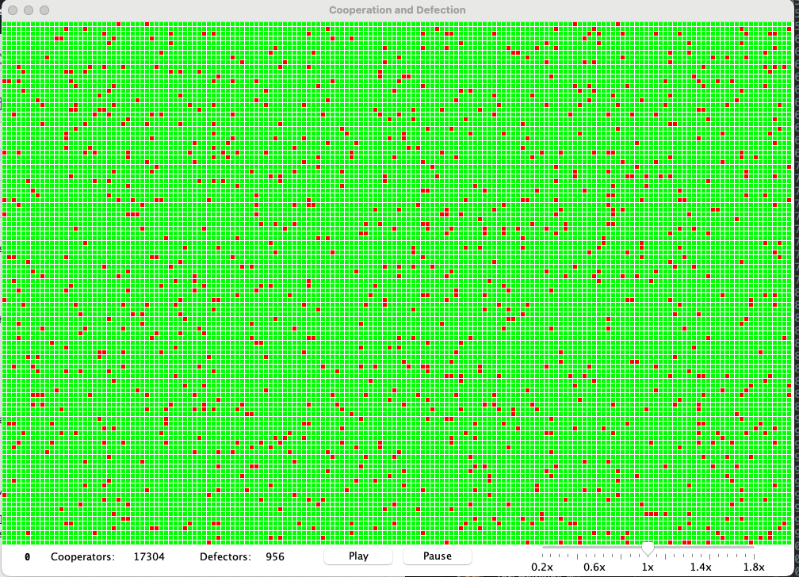
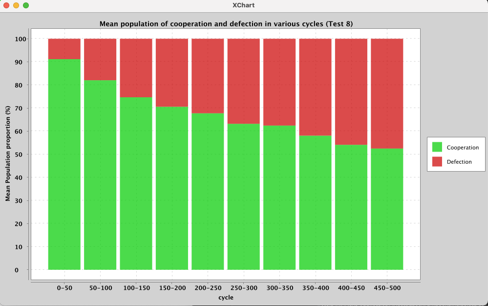

# Imitation_Project
The project contains the cellular automata model used for testing how imitation strategies effect cooperation and defection 
in a population.

## Dissertation 
To provide context for this project, I have attatched the report the models results contributed towards.

PDF to view 

## Requirements
* Java version 8
* IDE: Eclipse was used 
* Additional libaries: Ensure the xhart jar files are included when downloading the respository

## How to run the application
* Run from Main.java
* To adjust the resolution `private int resolution = 6;` location: GUI.java at the top of GUI class
* To change the imitation type for base rules. `newgrid[i][j] = randomImitate(grid,i,j)`; location: GUI.java/Game(Class)
in the `baseImitationRule(Color[][] grid, Color[][] newgrid)` method.
* Select either base or memory imitation `grid =baseImitationRule(grid, newGrid);` location: location: GUI.java/Game(Class)/task(class)
in the `run()` method

## How the model works
A GUI would appear during runtime. controls include start,pause,stop and a speed slider. The states of the cells can also be changed by clicking.
After 500 rounds, a histogram plot would be produced displaying the data from the simulation.

		    		 

